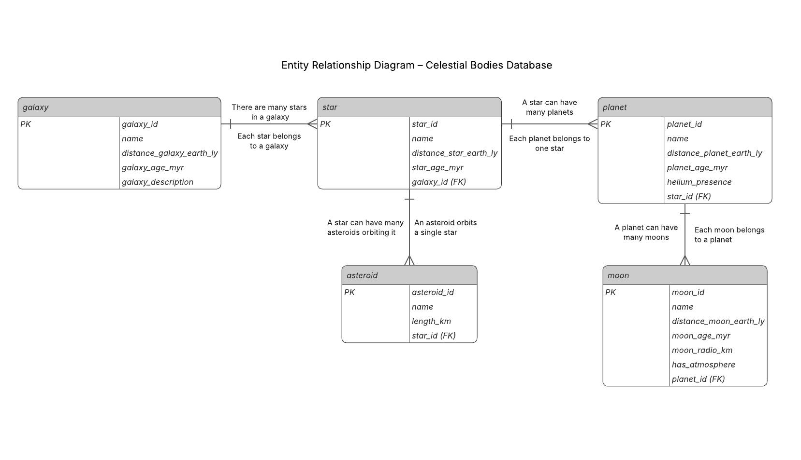

🌌 Celestial Bodies Database 🩵

Relational Databases Certification Project (freeCodeCamp)

This repository contains a project developed for the Relational Databases certification from freeCodeCamp.

The main objective was to design and build a relational database from scratch using PostgreSQL.

## Project Description

The database, named Universe, organizes information about various celestial bodies. 

Its design follows relational database principles, including the use of Primary Keys, Foreign Keys, and data type constraints.

While the theme is astronomical, the primary goal of this project was to practice relational database modeling and SQL design — not astrophysics expertise.

## Database Structure

The database includes the following tables:

galaxy: Stores data about different galaxies.

star: Stores data about stars, each linked to its respective galaxy.

planet: Stores data about planets, each linked to its respective star.

moon: Stores data about moons, each linked to its respective planet.

asteroid: Stores data about asteroids, each linked to its respective star.

## Technologies Used

SQL / PostgreSQL: For table creation, relationships, and queries.

Bash: For database automation and management via the terminal.

Git/GitHub: For version control.

Entity-Relationship Diagram (ERD)

## How to Use This Project
To use this database locally, follow these steps:
1. Clone the repository:
git clone https://github.com/delfitorres2405-cloud/celestial-bodies-database.git

2. Navigate into the project folder:
cd celestial-bodies-database

3. Restore the database using PostgreSQL. Make sure PostgreSQL is installed and running, then execute:
psql -U your_username < universe.sql

Replace your_username with your PostgreSQL username (commonly postgres).

4. Connect to the database:
psql -U your_username universe

You can now explore the tables and run SQL queries.
